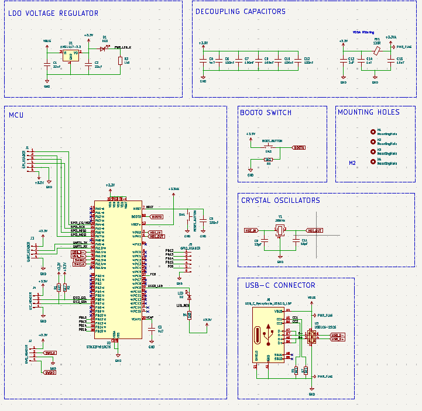
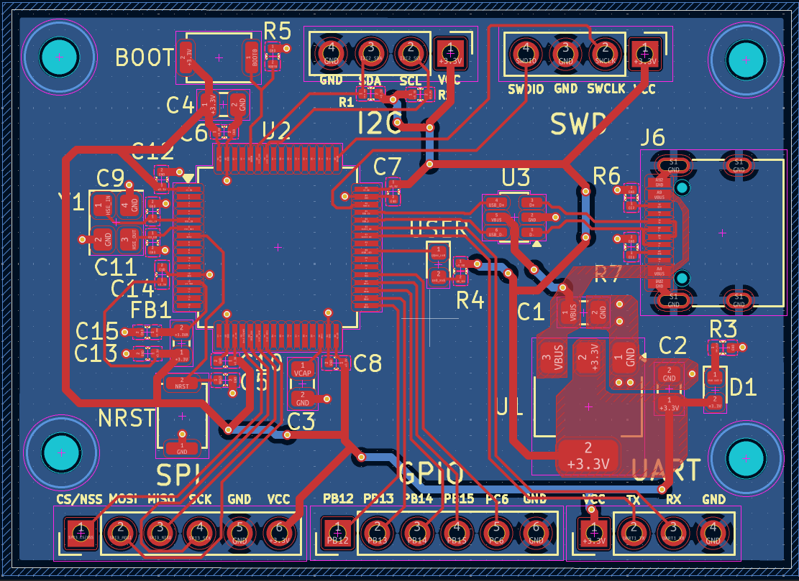
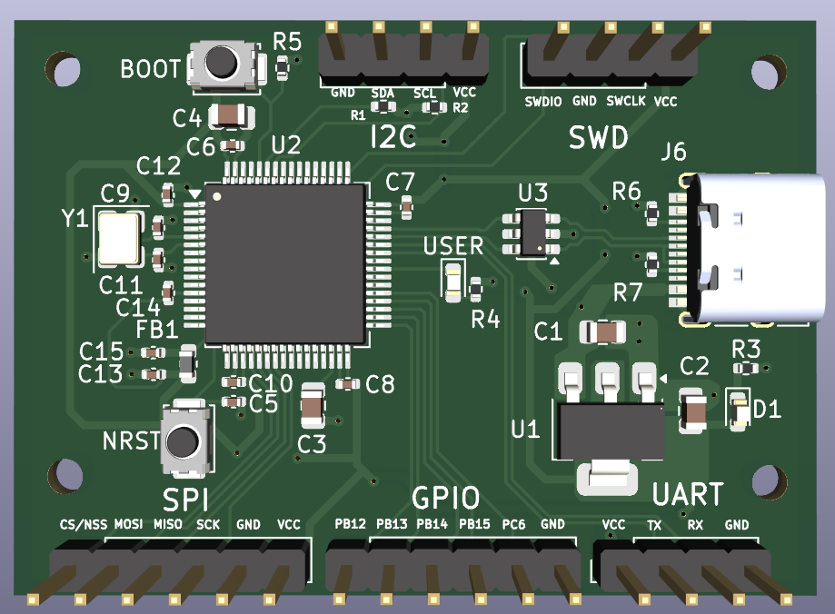
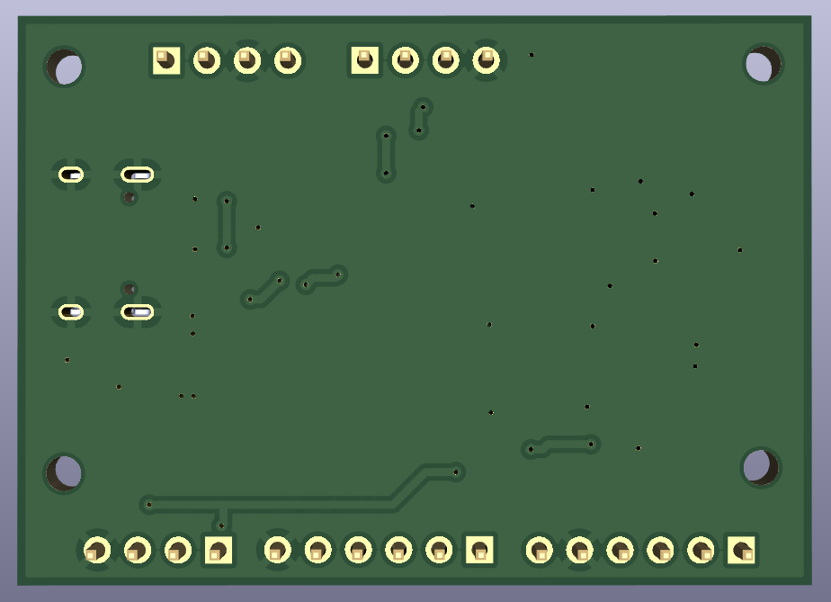

# STM32F401RCT6 Development Board

A compact development board built around the STM32F401RCT6 microcontroller. The design provides access to core peripherals via standard pin headers, incorporates dedicated power plane isolation for analog stability, and includes robust ESD protection for reliable USB communication. 

## Visuals

### Schematic Diagram

### PCB Layout

### 3D Renders
| Front View | Back View |
| :---: | :---: |
|  |  |

---

## Features

### 1. Core Processing & Clock System
* **Microcontroller:** STM32F401RCT6, 32-bit ARM Cortex-M4 core running up to 84 MHz.
* **High-Speed External (HSE) Clock:** $25\text{ MHz}$ crystal oscillator loop supplying the primary system and peripheral clock source.
* **Low-Speed External (LSE) Clock:** $32.768\text{ kHz}$ tuning-fork crystal providing timing for the internal Real-Time Clock (RTC).
* **Reset & Boot Controls:** Hardware reset circuitry utilizing an RC network connected to the `NRST` pin, paired with a dedicated physical push-button to pull `BOOT0` high for system bootloader entry.

### 2. Power Delivery & Noise Mitigation
* **Voltage Regulation:** AMS1117-3.3 Linear Voltage Regulator (LDO) stepping down a $5\text{V}$ input supply (via USB) to a regulated $+3.3\text{V}$ system rail, decoupled with dual $22\ \mu\text{F}$ bulk capacitors.
* **Digital Rail Decoupling:** Localized filtering network consisting of one $4.7\ \mu\text{F}$ bulk capacitor and five independent $100\text{ nF}$ capacitors dedicated to the $V_{DD}$ supply pins.
* **Analog Isolation ($+3.3\text{VA}$):** A $100\ \Omega$ (at $100\text{ MHz}$) ferrite bead creates a low-pass filter to separate the analog supply from digital switching noise, supported by dedicated $1\ \mu\text{F}$ and $100\text{ nF}$ capacitors.

### 3. Connectivity & Protection
* **USB-C Interface:** USB 2.0 downstream configuration over a physical USB-C connector using dual $5.1\text{ k}\Omega$ pulldown resistors on the `CC1` and `CC2` channels.
* **Transient Voltage Protection:** A USBLC6-2SC6 monolithic ESD protection diode array is placed directly on the `USB_D+` and `USB_D-` lines to safeguard internal transceivers against electrostatic discharge.
* **Peripheral Access:** Dedicated pin headers breaking out SPI (`SPI3`), I2C (`I2C2`), UART (`UART1`), Serial Wire Debug (`SWD`), and generic GPIOs.
* **System Status:** Physical LED indicators tracking power availability ($+3.3\text{V}$) and a user-programmable diagnostic LED linked to pin `PA0`.

---

